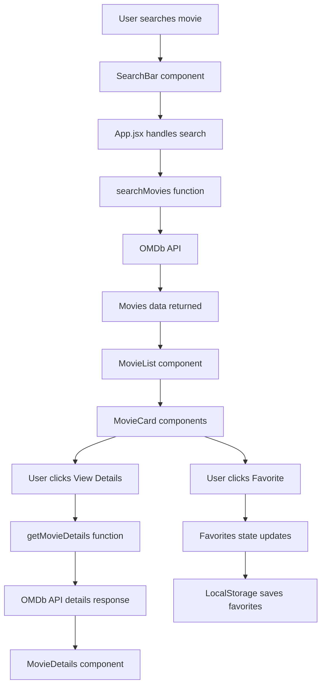

# MovieVerse - React Movie Search App

MovieVerse is a React-based movie search application that allows users to search movies, series, and episodes using the OMDb API. Users can view movie details, filter results by type, use pagination, and save favorite movies in LocalStorage.

## Live Demo

 https://deshrajvermay9517-png.github.io/movieverse/

## Features

* Search movies by title
* Filter results by movie, series, or episode
* View movie details
* Show movie poster, year, type, genre, director, actors, rating, runtime, and plot
* Add movies to favorites
* Remove movies from favorites
* Save favorites in LocalStorage
* Pagination with Previous and Next buttons
* Loading state while fetching data
* Error handling for invalid searches
* Responsive design for mobile and desktop

## Tech Stack

* React.js
* JavaScript
* CSS
* Vite
* OMDb API
* LocalStorage
* Fetch API

## Folder Structure

```text
src/
│
├── api/
│   └── omdb.js
│
├── components/
│   ├── Navbar.jsx
│   ├── SearchBar.jsx
│   ├── MovieCard.jsx
│   ├── MovieList.jsx
│   ├── MovieDetails.jsx
│   └── Favorites.jsx
│
├── App.jsx
├── main.jsx
└── index.css
```

## Project Workflow



## How This Project Works

The application starts from `main.jsx`, which renders the `App` component.

`App.jsx` is the main component of this project. It manages important states like search text, selected type, movie results, movie details, loading, error, pagination, and favorite movies.

The `SearchBar` component takes user input and sends the search query back to `App.jsx`.

The `omdb.js` file contains API functions. `searchMovies()` is used to search movies by title, and `getMovieDetails()` is used to fetch full details of a selected movie using its IMDb ID.

The `MovieList` component displays multiple movies by using the `map()` method.

The `MovieCard` component displays a single movie card with poster, title, year, type, View Details button, and Favorite button.

The `MovieDetails` component displays detailed information about a selected movie.

The `Favorites` component displays movies saved by the user. Favorite movies are stored in LocalStorage, so they remain saved even after refreshing the page.

## React Concepts Used

* Components
* Props
* useState
* useEffect
* Conditional rendering
* List rendering with map
* Event handling
* Controlled inputs
* API integration
* Loading and error handling
* LocalStorage
* Array methods like map, filter, and some

## Environment Variables

Create a `.env` file in the root folder and add your OMDb API key:

```env
VITE_OMDB_API_KEY=your_api_key_here
```

Important: Do not upload `.env` to GitHub.

## Run Locally

Clone the project:

```bash
git clone your-repository-link
```

Go to the project folder:

```bash
cd movieverse
```

Install dependencies:

```bash
npm install
```

Create a `.env` file and add your OMDb API key:

```env
VITE_OMDB_API_KEY=your_api_key_here
```

Start the development server:

```bash
npm run dev
```

## Future Improvements

* Add React Router for a separate movie details page
* Add debounce search
* Add dark and light mode toggle
* Add trending movies section
* Add login/signup
* Store favorites in backend database
* Add loading skeletons
* Add better pagination UI
